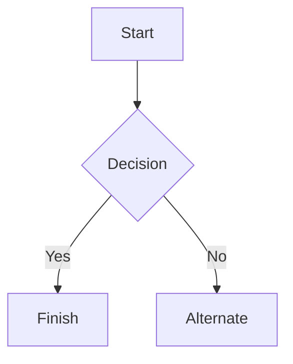
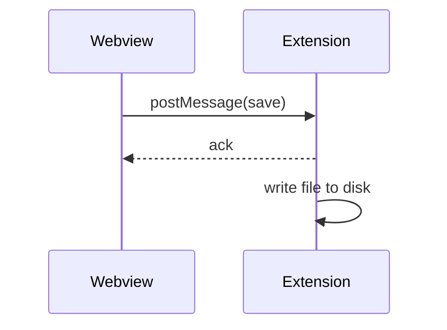

# Editor Markdown Notes

This note is a manual test fixture. It is meant to exercise every markdown feature the editor round-trips, plus a few long paragraphs for the writing tools (passive voice, simpler words, weak words, readability).

## Heading 2

### Heading 3

#### Heading 4

##### Heading 5

###### Heading 6

---

**Bold text**

_Italic text_

**_Bold and italic text_**

~~Strikethrough~~

`Inline code`

> Blockquote
>
> > Nested blockquote

---

- Unordered list item 1
- Unordered list item 2
  - Nested unordered item
    - Doubly nested unordered item

1. Ordered list item 1
2. Ordered list item 2
   1. Nested ordered item
      1. Doubly nested ordered item

- [x] Completed task
- [ ] Incomplete task
- [ ] Another incomplete task with **bold** and `code`

## Horizontal break 👇

---

## Code blocks

Fenced code blocks in a few common languages, to check syntax highlighting and round-tripping.

```html
<!-- HTML sample -->
<section class="card">
	<h2>Hello, world!</h2>
	<p>An <strong>HTML</strong> snippet with an attribute and a comment.</p>
</section>
```

```js
// JavaScript sample
function greet(name) {
	const message = `Hello, ${name}!`
	console.log(message)
	return message
}

greet('world')
```

```ts
// TypeScript sample
interface User {
	id: string
	name: string
	roles: ('admin' | 'editor' | 'viewer')[]
}

function isAdmin(user: User): boolean {
	return user.roles.includes('admin')
}
```

```json
{
	"name": "editor-markdown-notes",
	"private": true,
	"features": ["editor", "preview", "text-tools"],
	"version": 3
}
```

```bash
# Shell sample
pnpm install
pnpm dev --port 5173
```

```python
# Python sample
def fibonacci(n):
    a, b = 0, 1
    for _ in range(n):
        a, b = b, a + b
    return a
```

Here is a sentence with `inline code`, a second one with `pnpm lint`, and a third referencing the `useTextTools` hook by name.

## Mermaid diagram





## Table

| Feature   | Status      | Notes                                     |
| --------- | ----------- | ----------------------------------------- |
| Tables    | **Shipped** | Cells keep `inline code` and marks        |
| Task list | **Shipped** | Checkboxes round-trip their checked state |
| Footnotes | Missing     | See [the docs](https://example.com)       |

## Table with column alignment

| Left | Centered | Right |
| :--- | :------: | ----: |
| a    |    b     |     c |
| dd   |    ee    |    ff |

## Image (relative path)


## Links

An inline [link to example.com](https://example.com), a [link with a title](https://example.com 'Example Domain'), a reference-style link[^ref], and a bare autolink: https://example.com

A relative link to the [other note](./other-note.md), and a mailto link to [mail@hello.co](mailto:mail@hello.co).

[^ref]: This footnote-style reference is not supported (see CLAUDE.md); it renders as raw HTML.

---

## Long-form text: passive voice test

The report was written by the intern over the weekend, and several of the figures in it were later found to be incorrect by the finance team. Mistakes were made throughout the process, and no one was held accountable for them. The final decision was made by the committee only after the deadline had already been missed by two other departments. It is believed by most of the staff that the schedule was set unrealistically from the very beginning.

By contrast, this paragraph favors the active voice: the intern wrote the report over the weekend, and the finance team later found several errors in it. The committee made the final decision only after two other departments missed the deadline. Most staff believe the schedule was unrealistic from the start.

## Long-form text: simpler word alternatives test

Prior to finalizing the implementation, we should endeavor to ascertain whether the proposed methodology is sufficiently robust to accommodate future modifications. The utilization of overly verbose terminology can frequently obfuscate an otherwise straightforward concept, and it is incumbent upon the author to facilitate comprehension for the reader. In numerous instances, a more parsimonious selection of vocabulary would substantially expedite the reader's ability to comprehend the underlying subject matter without requiring supplementary clarification.

## Long-form text: weak words and hedging test

This is basically a pretty simple change, and it's actually really quite easy to understand once you sort of get the hang of it. There are various reasons why this might possibly be a somewhat better approach, but it could arguably also just be a very minor improvement that isn't really that significant. I think it's fairly obvious that we should probably just go ahead and try it, even though it's kind of hard to tell for certain whether it will actually work in every single case.

## Long-form text: readability / reading grade test

### Easy (short sentences, plain words)

The cat sat on the mat. It was warm in the sun. The dog ran past the gate. It did not stop to look. The children played in the yard until dusk.

### Hard (long sentences, dense vocabulary)

Notwithstanding the aforementioned considerations, the ramifications of implementing an architecturally heterogeneous, polyglot-persistence data layer without first establishing a comprehensive, cross-functionally validated governance framework are, in the estimation of the steering committee, sufficiently consequential as to warrant a thoroughgoing, multi-quarter reassessment of the organization's overarching technical strategy, particularly insofar as it pertains to the long-term maintainability, extensibility, and operational resilience of the systems in question.

## Miscellaneous inline formatting

A paragraph mixing **bold**, _italic_, **_bold italic_**, ~~strikethrough~~, `inline code`, and a [link](https://example.com) all in the same sentence, followed by a footnote-style aside (not supported) and an em dash — like this — plus an ellipsis…
