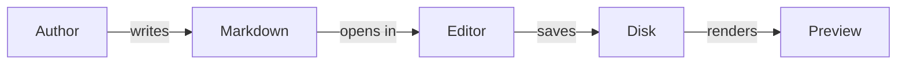

# other-note.md

This is the companion fixture to [notes.md](./notes.md). It repeats the
core markdown syntax, but with an absolute image path, different link
styles, and a fresh set of long-form paragraphs so the writing tools have
more than one sample to chew on.

## Heading 2

### Heading 3

#### Heading 4

##### Heading 5

###### Heading 6

---

**Bold text**

_Italic text_

**_Bold and italic text_**

~~Strikethrough~~

`Inline code`

> Blockquote
>
> > Nested blockquote
> >
> > > Triple-nested blockquote

---

- Unordered list item 1
- Unordered list item 2
  - Nested unordered item

1. Ordered list item 1
2. Ordered list item 2
   1. Nested ordered item

- [x] Completed task
- [ ] Incomplete task

## Horizontal break 👇

---

## Code blocks

```html
<!-- Another HTML sample -->
<form action="/submit" method="post">
	<label for="email">Email</label>
	<input id="email" name="email" type="email" required />
</form>
```

```js
// JavaScript sample: array methods
const numbers = [1, 2, 3, 4, 5]
const doubled = numbers.map((n) => n * 2)
const total = doubled.reduce((sum, n) => sum + n, 0)
```

```ts
// TypeScript sample: generics
function first<T>(items: T[]): T | undefined {
	return items.at(0)
}

type Result<T> = { ok: true; value: T } | { ok: false; error: string }
```

```json
{
	"editorMarkdownNotes": {
		"theme": "system",
		"fullWidth": false,
		"targetReadingAge": 12
	}
}
```

```css
/* CSS sample */
.note-card {
	display: flex;
	gap: 0.5rem;
	border-radius: 0.5rem;
}
```

A line with `inline code`, a config key like `editorMarkdownNotes.theme`,
and a shell flag such as `--fix` mentioned mid-sentence.

## Mermaid diagram



## Table

| Feature   | Status      | Notes                                     |
| --------- | ----------- | ----------------------------------------- |
| Tables    | **Shipped** | Cells keep `inline code` and marks        |
| Task list | **Shipped** | Checkboxes round-trip their checked state |
| Footnotes | Missing     | See [the docs](https://example.com)       |

## Table with column alignment

| Left | Centered | Right |
| ---- | -------- | ----- |
| a    | b        | c     |
| dd   | ee       | ff    |

## Image (absolute path)


## Links

An inline [link to example.com](https://example.com), and a bare autolink:
<https://example.com>

A relative link back to [notes.md](./notes.md), an anchor link to the
[headings section](#heading-2) further up this page, and a mailto link to
[mail@hello.co](mailto:mail@hello.co).

Plain, unlinked URL for autolink detection: https://example.com/docs?ref=fixture

---

## Long-form text: passive voice test

The new editor was built by a small team over several months, and the
feedback was collected from beta testers throughout that period. Several
bugs were reported by users in the first week, and most of them were fixed
before the public release. It was decided by the maintainers that the
release notes would be written after the changelog was finalized.

Rewritten in the active voice: a small team built the new editor over
several months and collected feedback from beta testers throughout. Users
reported several bugs in the first week, and the maintainers fixed most of
them before the public release.

## Long-form text: simpler word alternatives test

In order to facilitate a more expeditious onboarding experience, it is
advisable that the documentation endeavor to utilize terminology that is
readily comprehensible to individuals who do not possess a preexisting
familiarity with the underlying technical apparatus. Subsequent to the
initial deployment, the development team ascertained that numerous users
had encountered difficulty in the utilization of the aforementioned
configuration interface.

## Long-form text: weak words and hedging test

Honestly this is probably just a really minor thing, but it's sort of
worth mentioning that the feature could possibly maybe need a bit more
testing. It's kind of unclear whether this is actually a real problem or
just a very small edge case that basically never happens. Either way, it
seems like it's fairly likely that someone should eventually just take a
quick look at it at some point.

## Long-form text: readability / reading grade test

### Easy (short sentences, plain words)

The sun was bright. Birds sang in the trees. A boy walked down the road.
He held a red kite. The wind picked up and the kite began to rise.

### Hard (long sentences, dense vocabulary)

The interdependencies inherent in a distributed, eventually-consistent
system architecture necessitate a comprehensive understanding of the
trade-offs between availability, partition tolerance, and consistency,
particularly when the system in question is subjected to non-trivial
volumes of concurrent, geographically-distributed write operations that
must ultimately be reconciled through a conflict-resolution mechanism
whose correctness properties are, at best, only probabilistically
guaranteed under adversarial network conditions.

## Miscellaneous inline formatting

A paragraph mixing **bold**, _italic_, **_bold italic_**, ~~strikethrough~~,
`inline code`, and a [link](https://example.com), with an em dash — used
here — and a trailing ellipsis…
