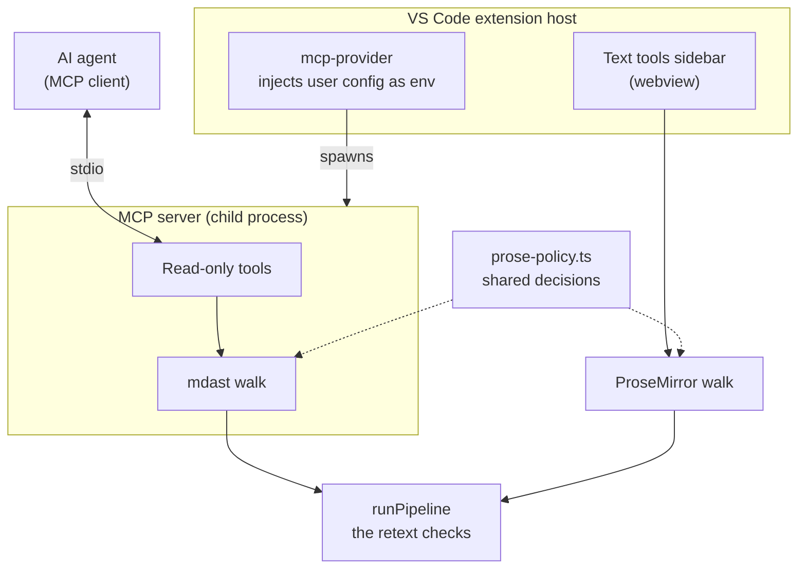

# The MCP server

Exposes the text tools' writing checks to AI agents, so an agent editing a note reaches the same judgement the sidebar shows a human.

- Agents already read and write markdown fine.
- What they cannot do is compute retext's findings, or know _this_ user's reading age, English variant and personal dictionary.
- So: the server supplies judgement, the agent supplies editing.

## How to use

No setup. The server ships with the extension and VSCode discovers it on its own. When it first appears the editor offers a refresh to pick up the new tools — accept it, and any MCP client in the editor can use them.

- **It follows your settings.** Reading age, English variant, which checks are enabled and your personal word list all come from the extension's own configuration, so an agent judges a note the way your sidebar does. Change a setting and the server picks it up the next time it starts.
- **Just ask in plain language.** The agent picks the tool. "Check this note for passive voice", "which sentences here are too hard for a 14-year-old?", "spell-check my draft and fix the real typos".
- **It advises, it does not edit.** Findings come back with a line number and the sentence they sit in; the agent makes the edits with its normal tools, so they land in undo history like any other change.
- **Accepting project jargon.** Ask the agent which flagged words look like vocabulary rather than mistakes, then add the ones you want with **Editor Markdown Notes: Add words to dictionary** in the Command Palette. The server cannot change your settings itself.
- **If something looks wrong.** Search `MCP` in the Command Palette: the output view carries this server's log, and there are commands to restart it or reset its cached tool list.

### What the agent gets

A check returns the same summary the sidebar shows, plus one entry per finding. Illustrative, not a contract — the tools describe their own current shape:

```jsonc
{
	"summary": ["1 of 5 sentences are hard to read"],
	"issues": [
		{
			"rule": "passive",
			"severity": "warning",
			"line": 7, // into the markdown file, not the extracted prose
			"column": 16,
			"actual": "written",
			"sentence": "The report was written by the committee.",
			"expected": [], // suggested replacements, where a rule offers them
			"message": "Unexpected use of the passive voice",
		},
	],
}
```

`sentence` is the part that matters: it is what the agent matches on to edit the right place, which is why findings carry it rather than offsets alone.

## Architecture



## Decisions

- **No write-back tools.** They would duplicate the agent's own edit tool, which matches on content rather than position and so cannot drift as a document changes. A positional write would also race the auto-save debounce against what the webview still holds in memory.
  - Findings instead carry the surrounding sentence, as an anchor for an exact-match edit the agent makes itself.
- **A child process, not HTTP in the host.** Keeps the retext stack and a half-megabyte word list off the event loop every other extension shares, and opens no port to authenticate.
  - Consequence: no `vscode` module, so the server reads and cannot write. Changing a setting stays a host command — the jargon tool proposes words, a palette command accepts them.
  - Also the reversible order. Live-editor-state tools (active note, selection, unsaved buffer) would need HTTP, but adding them later is additive; starting with HTTP and retreating would mean taking tools away.
- **Source line/column, never pipeline offsets.** Offsets are into flattened prose and mean nothing to something holding the real file — handing one out sends an agent to edit a plausible wrong place, silently.
- **All logging goes to stderr; stdout is the transport.** A stray line on stdout desynchronises the JSON-RPC framing and the server stops answering — a failure that looks like a hang, not like a log statement. `console` is redirected to stderr at startup so a chatty dependency cannot cause it.
  - Errors are logged with their stack and rethrown: the SDK turns a throw into a result the agent can read, while the stack stays out of the model's face.
- **Tool and server names are a published API.** Nothing in the type system protects them the way `Record<TextToolRuleId, …>` protects the rules table. Adding is free; renaming breaks whatever named them.

## Prose extraction is implemented twice

- Everything downstream of it — rules, severities, readability tiers, the speller — is the same code as the panel runs, called from a second place.
- Extraction is not, because the editor's document model needs React node views this process cannot load.
- `prose-policy.ts` holds what both walks must agree on: what counts as prose, what a code span leaves behind, how frontmatter is read.
- The exclusion vocabulary is typed, so a construct added to one side fails to compile until the other handles it.
- **`prose-parity.test.ts` is the actual guard.** Read it before changing either walk. A failure means the server has started reporting findings the sidebar does not — the failure this whole arrangement exists to prevent.

## Trade offs

- The extension activates at startup rather than waiting for a markdown file: an unregistered provider offers no server to discover. Every user pays it.
- All three dictionaries ship in the `.vsix` and dominate its size, though only the language asked for is read. The reason to think twice about a fourth.
